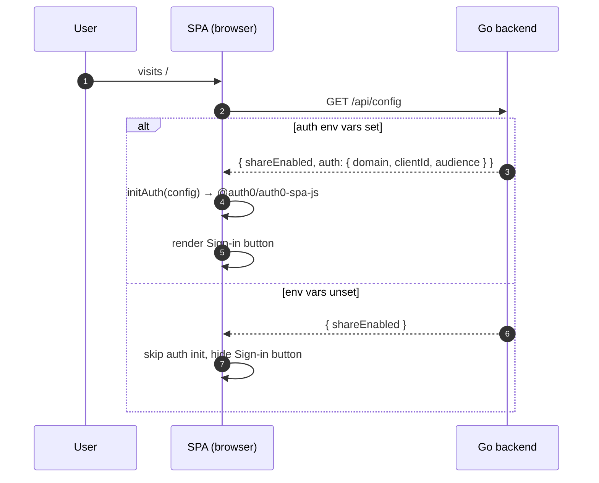
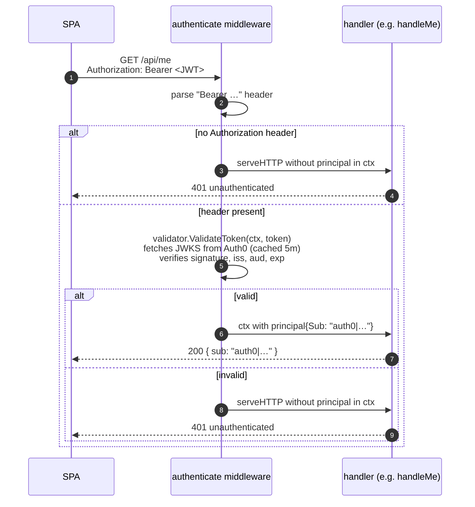
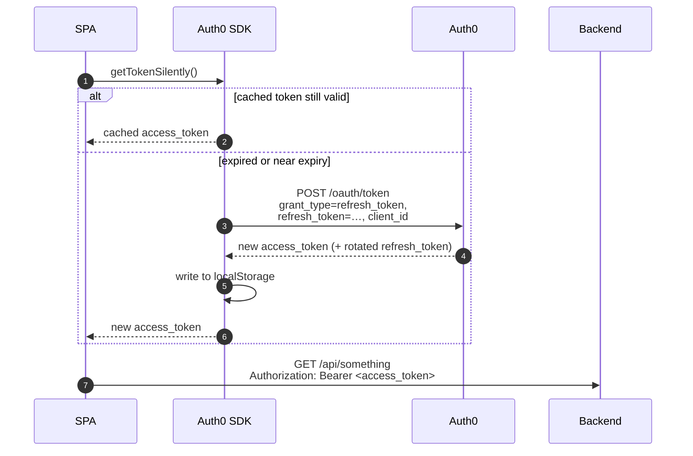
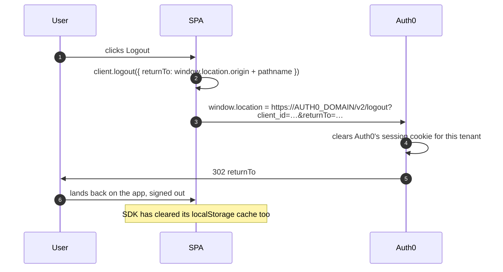

# Authentication in zorto

This document explains how login works in zorto end-to-end. It assumes **no prior
knowledge of OAuth2 or OIDC** — the concepts are introduced as they appear. If
you only want to flip auth on, jump to [Setup](#setup).

> Auth in zorto is **opt-in** and **identity-only**. If the three `AUTH0_*`
> environment variables are unset, the **Sign in** button never appears and
> every endpoint behaves as it did before. Sharing remains end-to-end encrypted
> regardless of whether a user is logged in — login proves *who* a request is
> coming from but it does not change what the server can see.

---

## 1. The cast of characters

Authentication involves three parties. Keep them straight and the rest follows:

| Party | What it is in zorto | Common OAuth2 name |
|-------|---------------------|--------------------|
| **User** | A human in a browser tab | Resource Owner |
| **Frontend** | The Vite-built SPA in `web/` running in the user's browser | Client (public) |
| **Backend** | The Go HTTP server in `main.go` / `auth.go` | Resource Server |
| **Auth0** | Auth0 tenant, e.g. `qibli.eu.auth0.com` | Authorization Server / Identity Provider |

zorto's backend is **not** the authority on identity — Auth0 is. The backend
*verifies* tokens that Auth0 issued; it never sees a user's password.

---

## 2. Concepts you need (the ten-minute version)

### OAuth2

OAuth2 is a protocol for letting one system (the **frontend**) get a
time-limited *access token* it can present to another system (the **backend**)
on behalf of a user, *without* the frontend ever handling that user's password.
The user types their password into Auth0's hosted login page; Auth0 hands the
frontend a token; the frontend hands the token to the backend.

### OIDC

OIDC (OpenID Connect) is a thin layer on top of OAuth2 that adds a *second*
token — the **ID token** — whose purpose is purely "this is who the user is"
(name, email, subject id). OAuth2 alone only says "the bearer of this token is
allowed to do X"; OIDC adds "and by the way, the bearer is *user U*."

zorto uses both: OIDC for the user's display name/avatar, OAuth2 for
authorising calls to the backend.

### JWT

Both tokens are **JWTs** (JSON Web Tokens). A JWT is just three base64url
chunks separated by dots: `header.payload.signature`. The header and payload
are JSON; the signature is computed by Auth0 with its **private** RSA key. The
backend verifies signatures with Auth0's **public** key, which it fetches from
a well-known URL (the JWKS endpoint — see [§7](#7-backend-validation-deep-dive)).

A JWT carries **claims** — fields like:
- `iss` (issuer): which Auth0 tenant minted it.
- `aud` (audience): which API it is intended for. zorto's backend checks this
  matches `AUTH0_AUDIENCE`.
- `sub` (subject): a stable, opaque user id like `auth0|abc123`.
- `exp` (expires at): unix timestamp; expired tokens are rejected.

### Access token vs ID token

| | Access token | ID token |
|--|--------------|----------|
| Who reads it | Backend | Frontend |
| What it says | "Bearer may call API X" | "Authenticated user is U" |
| Sent on API calls | **Yes** (`Authorization: Bearer …`) | No, never leaves the SPA |
| `aud` claim | API identifier (`AUTH0_AUDIENCE`) | Client ID |

### PKCE — what it is and why

The SPA runs in the browser. It cannot keep a secret: anyone can open devtools
and read its source. So zorto's Auth0 application is configured with
**Token Endpoint Auth Method = None** (no client secret).

This raises an attack: a malicious app on the user's machine could intercept
the redirect and steal the authorisation code. **PKCE** (Proof Key for Code
Exchange, pronounced "pixie") fixes this:

1. Before redirecting the user to Auth0, the SPA generates a random
   **code_verifier** and keeps it in memory.
2. It hashes the verifier (SHA-256) to produce a **code_challenge** and sends
   the *challenge* to Auth0 with the login request.
3. When Auth0 redirects back with an authorisation code, the SPA exchanges
   that code for tokens — and must include the original *verifier*. Auth0
   re-hashes it and checks it matches the challenge it stored.

Net effect: even if an attacker steals the code from the redirect URL, they
can't redeem it, because they don't have the verifier.

The Auth0 SPA SDK (`@auth0/auth0-spa-js`) handles all of this — zorto's code
just calls `loginWithRedirect()` and `handleRedirectCallback()`.

---

## 3. Components in this repo

```
┌─────────────────────────────────────────────────────────────┐
│  Browser                                                     │
│  ┌───────────────────────────────────────────────────────┐  │
│  │  SPA (web/)                                            │  │
│  │   • web/src/auth.js   — wraps @auth0/auth0-spa-js      │  │
│  │   • web/src/main.js   — wires Sign-in / Logout buttons │  │
│  └───────────────────────────────────────────────────────┘  │
└─────────────────┬───────────────────────────┬───────────────┘
                  │ Authorization: Bearer …   │ Redirect (login)
                  ▼                           ▼
┌──────────────────────────────┐  ┌──────────────────────────┐
│  Go backend                   │  │  Auth0                   │
│   • main.go    (routes)       │  │   • Hosted login page    │
│   • auth.go    (JWT validate) │  │   • /oauth/token         │
│   • /api/config  →  public    │  │   • /.well-known/jwks    │
│   • /api/me      →  needs JWT │  │                          │
└──────────────────────────────┘  └──────────────────────────┘
```

Key source files:

- `auth.go` — `loadAuthConfig`, `newTokenValidator`, `authenticate` middleware,
  and `handleMe`. About 110 lines; read it top to bottom.
- `main.go:75-107` — wires `/api/config` (advertises auth settings to the SPA)
  and mounts `/api/me` behind the validator middleware, *only if* auth is
  configured.
- `web/src/auth.js` — thin wrapper around `@auth0/auth0-spa-js`: `initAuth`,
  `login`, `logout`, `getAccessToken`, and `authFetch` (a `fetch` helper that
  attaches `Authorization: Bearer <token>` automatically).
- `web/src/main.js:272-288` — `applyServerConfig()` fetches `/api/config`,
  initialises the SDK, and shows or hides the Sign-in / avatar UI accordingly.

---

## 4. Bootstrap: how the SPA learns whether auth is on

The SPA does not bake the Auth0 settings into its bundle. Instead, on every
load it asks the backend:



This means **flipping auth on or off requires only a server restart** — no
rebuild of the SPA. The values served by `/api/config` are public (the
Client ID and audience are *meant* to be visible to the browser).

Code references:
- Server side: `main.go:93-104`.
- Client side: `web/src/main.js:272-288`, `web/src/auth.js:6-31`.

---

## 5. Login: Authorization Code + PKCE, end to end

This is the flow that runs when a user clicks **Sign in**. It is the modern
recommended flow for SPAs and is exactly what `loginWithRedirect()` does
under the hood.

```mermaid
sequenceDiagram
    autonumber
    participant U as User
    participant S as SPA
    participant A as Auth0
    participant B as Backend

    U->>S: clicks "Sign in"
    Note over S: Generates PKCE pair:<br/>verifier = random 43+ chars<br/>challenge = SHA256(verifier) (b64url)
    S->>S: stash verifier + state in sessionStorage
    S->>U: window.location = https://AUTH0_DOMAIN/authorize?...<br/>client_id, redirect_uri, audience,<br/>response_type=code, code_challenge,<br/>code_challenge_method=S256, state, scope=openid profile email
    U->>A: follows redirect
    A->>U: shows hosted login page
    U->>A: submits credentials (or social login)
    A->>U: 302 redirect_uri?code=AUTHCODE&state=STATE
    U->>S: browser navigates back to SPA
    Note over S: handleRedirectCallback() runs<br/>checks state matches, then…
    S->>A: POST /oauth/token<br/>grant_type=authorization_code,<br/>code=AUTHCODE, code_verifier=VERIFIER,<br/>client_id, redirect_uri
    A->>A: hashes verifier; compares to stored challenge
    A-->>S: { access_token, id_token, refresh_token, expires_in }
    S->>S: stores tokens in localStorage<br/>(cacheLocation: "localstorage")
    S->>S: window.history.replaceState() to strip code/state<br/>from the URL
    S->>S: refreshAuthUI() → show avatar, hide Sign-in
    Note over S,B: User is now logged in.<br/>Subsequent API calls attach the access token.
    S->>B: GET /api/me<br/>Authorization: Bearer ACCESS_TOKEN
    B->>B: validate JWT (see §7)
    B-->>S: { sub: "auth0|…" }
```

Things worth noticing:

- **`state`** is an unrelated random value the SDK uses to detect CSRF on the
  redirect back. If `state` in the callback URL doesn't match what the SDK
  stored, the callback is rejected.
- **`scope=openid profile email`** asks Auth0 for an ID token containing the
  user's name, email, and picture. These are read by `auth.getUser()` and used
  by `refreshAuthUI()` to render the avatar/menu.
- **`audience=AUTH0_AUDIENCE`** is what makes Auth0 issue an *access token*
  for our backend specifically. Without an audience, Auth0 only returns an
  opaque token suitable for its own `/userinfo` endpoint — not a JWT the
  backend can validate.
- The whole exchange completes in two HTTP redirects + one POST. From the
  user's perspective: click → hosted login → back to the app, signed in.

Code path:
- `web/src/auth.js:45-48` — `login()` just calls
  `client.loginWithRedirect()`.
- `web/src/auth.js:20-29` — on the SPA's *next* load (after the redirect
  back), if the URL has `?code=…&state=…`, the SDK exchanges the code for
  tokens, then `replaceState` strips the code from the address bar.

---

## 6. Authenticated API calls

Once logged in, the SPA can call protected endpoints. The pattern is:

```js
// web/src/auth.js
export async function authFetch(input, init = {}) {
  const token = await getAccessToken();
  if (!token) return fetch(input, init);
  const headers = new Headers(init.headers || {});
  headers.set("Authorization", `Bearer ${token}`);
  return fetch(input, { ...init, headers });
}
```

`getAccessToken()` calls the SDK's `getTokenSilently()`. That method:

1. Returns a cached access token if it is still valid.
2. Otherwise transparently uses the **refresh token** to mint a new access
   token in the background (see [§8](#8-token-refresh-and-session-lifetime)).

The backend handles the request like this:



A subtlety: `authenticate` is **non-rejecting**. An invalid or missing token
does *not* short-circuit with a 401 — the request continues with no principal
in the context, and each handler decides whether to require one. Today only
`/api/me` needs a principal, but this design lets future endpoints accept a
mix of anonymous and authenticated traffic without rewiring the middleware.

See `auth.go:77-97` (middleware) and `auth.go:108-116` (handler).

---

## 7. Backend validation deep-dive

`newTokenValidator` (`auth.go:42-59`) builds a validator from the
`go-jwt-middleware/v2` library:

```go
provider := jwks.NewCachingProvider(issuer, 5*time.Minute)
v, err := validator.New(
    provider.KeyFunc,
    validator.RS256,
    issuer.String(),
    []string{cfg.Audience},
    validator.WithAllowedClockSkew(30*time.Second),
)
```

What this enforces on every `/api/me` call:

1. **Signature** — the JWT was signed with the private key matching one of
   the public keys at `https://<AUTH0_DOMAIN>/.well-known/jwks.json`. The
   provider caches that JWKS document for 5 minutes to avoid hammering Auth0
   on every request.
2. **Algorithm pinning** — only `RS256` is accepted. This blocks the classic
   "alg=none" and "alg=HS256 with the public key as secret" attacks.
3. **Issuer** — `iss` must equal `https://<AUTH0_DOMAIN>/` (with the trailing
   slash).
4. **Audience** — `aud` must contain `AUTH0_AUDIENCE`. A common cause of 401s
   is a mismatch here; the value must match the API Identifier *exactly*,
   including the `https://` and any trailing slash.
5. **Expiry** — `exp` must be in the future, with up to 30 s of clock skew
   tolerated.

If any check fails, `ValidateToken` returns an error and the handler runs
without a principal — `handleMe` then writes `401 unauthenticated`.

The principal we extract is just the `sub` claim. Storing or correlating
data per-user means using that string as a foreign key. zorto's current
schema does not — `/api/me` is the only authenticated endpoint, and it
returns the `sub` to the SPA so it can be displayed.

---

## 8. Token refresh and session lifetime

Access tokens are **short-lived** (Auth0's default for SPAs is around an hour;
configurable on the API). To stay logged in beyond that without bouncing the
user back to the hosted login page, the SDK uses a **refresh token**.

`web/src/auth.js:6-18` configures this:

```js
client = await createAuth0Client({
  domain, clientId,
  authorizationParams: { audience, redirect_uri: … },
  cacheLocation: "localstorage",   // survives tab close
  useRefreshTokens: true,          // mint refresh tokens
});
```

`useRefreshTokens: true` requires that:

- The Auth0 application has the **Refresh Token** grant enabled.
- The Auth0 API has **Allow Offline Access** enabled.
- (Recommended) **Refresh Token Rotation** is enabled — every refresh
  invalidates the old refresh token and issues a new one, so a stolen
  refresh token is single-use.

Refresh sequence:



**Why localStorage and not a cookie?** zorto's backend never issues session
cookies — it is stateless, and treats each request purely on the strength of
the bearer token. Storing tokens in `localStorage` is the standard pattern
for SPA SDKs that don't want to rely on first-party cookies, and the trade-off
(susceptibility to XSS) is the same one the rest of the SPA already lives
with: the editor stores plaintext drafts in `localStorage` too.

---

## 9. Logout



What logout does and doesn't do:

- ✅ Clears the SDK's `localStorage` cache (access + refresh + ID tokens).
- ✅ Clears Auth0's tenant-side session cookie. A subsequent click on
  **Sign in** re-prompts for credentials.
- ❌ Does **not** revoke previously-issued access tokens. They remain valid
  on the backend until they expire. There is no cross-instance "kill switch";
  this is intentional for stateless validation.

Code: `web/src/auth.js:50-57`, called from
`web/src/main.js:262-266`.

---

## 10. What login does *not* change

Worth saying explicitly because it's easy to assume otherwise:

- **Sharing is still anonymous.** `POST /api/shares` and
  `GET /api/shares/{id}` accept any caller. The auth middleware is only
  mounted on `/api/me`. If you want share creation to require login, the
  change is one line in `main.go` — wrap the share routes in `tv.authenticate(...)`
  and have them check `principalFrom(r.Context())`.
- **End-to-end encryption is unchanged.** The server still only sees opaque
  ciphertext; the AES key still stays in the URL fragment. Logging in does
  not make the server able to read your shares.
- **Working drafts in `localStorage`** are still per-browser, not per-user.
  Logging in on a different machine won't pull your drafts over — there is no
  server-side draft storage at all.

---

## 11. Setup

The runtime configuration consists of three environment variables:

| Env var | Example | Where it comes from |
|---------|---------|---------------------|
| `AUTH0_DOMAIN` | `qibli.eu.auth0.com` | Auth0 → Application → Settings → **Domain** |
| `AUTH0_CLIENT_ID` | `aB1cD2eF3gH4iJ5kL6mN7oP8qR9sT0uV` | Auth0 → Application → Settings → **Client ID** |
| `AUTH0_AUDIENCE` | `https://zorto.qibli.net/api` | Auth0 → APIs → **Identifier** |

If any of the three is missing, auth is disabled.

### 11.1 Create the Auth0 tenant

If you don't already have one:

1. Sign up at <https://auth0.com/signup>.
2. Pick a tenant region (closest to your users) and tenant name, e.g.
   `zorto-prod`. Your domain becomes `zorto-prod.<region>.auth0.com`.
3. *(Optional)* Configure a custom domain (`auth.qibli.net`) under **Branding →
   Custom Domains** to avoid `*.auth0.com` cookies. Not required.

For non-prod tinkering, reuse the same tenant — just create a separate
**Application** per environment.

### 11.2 Create the Application (the SPA registration)

1. **Applications → Applications → Create Application**.
2. Name: `Zorto Web` (or `Zorto Web (dev)`).
3. Type: **Single Page Web Applications**.
4. Click **Create**, then open the **Settings** tab and fill in:

   | Field | Value |
   |-------|-------|
   | **Allowed Callback URLs** | `http://localhost:5173/, https://qibli.net/zorto/` |
   | **Allowed Logout URLs**   | `http://localhost:5173/, https://qibli.net/zorto/` |
   | **Allowed Web Origins**   | `http://localhost:5173, https://qibli.net` |
   | **Application Login URI** | *(leave blank)* |
   | **Token Endpoint Auth Method** | `None` (default for SPA — no client secret) |

5. Under **Advanced Settings → Grant Types**, ensure **Authorization Code**
   and **Refresh Token** are enabled (the default). Leave **Implicit**
   disabled — we use Authorization Code + PKCE.
6. Save. From this page, note **Domain** and **Client ID**.

### 11.3 Create the API (the audience)

The API identifier is what the backend validates the access token's `aud`
claim against. It's a stable identifier, **not** a URL that needs to resolve.

1. **Applications → APIs → Create API**.
2. Name: `Zorto API`.
3. Identifier: `https://zorto.qibli.net/api` (any URI-shaped string is fine —
   pick one and never change it; this becomes `AUTH0_AUDIENCE`).
4. Signing Algorithm: **RS256** (default — do not switch to HS256).
5. Click **Create**.
6. Leave **Allow Offline Access** enabled so refresh tokens work.

### 11.4 Verify the JWKS endpoint

Sanity-check the domain before bringing up the backend so a typo surfaces
here, not at first login:

```sh
curl -sSf "https://<your-domain>/.well-known/jwks.json" | head
```

You should see a JSON object with a `keys` array.

### 11.5 Run zorto with auth on

Local development:

```sh
export AUTH0_DOMAIN=qibli.eu.auth0.com
export AUTH0_CLIENT_ID=<CLIENT_ID>
export AUTH0_AUDIENCE=https://zorto.qibli.net/api
make run
```

In a separate terminal: `cd web && npm run dev`. Vite proxies `/api/*` to the
Go server, so `/api/config` reports auth as enabled and the **Sign in** button
renders.

Production (systemd) — add to `/etc/systemd/system/zorto.service` under
`[Service]`:

```ini
Environment=AUTH0_DOMAIN=qibli.eu.auth0.com
Environment=AUTH0_CLIENT_ID=<CLIENT_ID>
Environment=AUTH0_AUDIENCE=https://zorto.qibli.net/api
```

Then:

```sh
sudo systemctl daemon-reload
sudo systemctl restart zorto
```

To **disable** login again, remove the `Environment=` lines and restart. The
SPA reads `/api/config` on load and hides the **Sign in** button if auth is
not configured.

---

## 12. Smoke test

1. Open the app. The **Sign in** button should be visible.
2. Click it; you should be redirected to `https://<AUTH0_DOMAIN>/u/login`.
3. Sign up or log in.
4. After redirecting back, the toolbar should show your avatar and a
   **Logout** entry in its dropdown.
5. In devtools, watch `GET /api/me` — it should return `{ "sub": "auth0|…" }`
   with a `200`.

---

## 13. Troubleshooting

**`/api/me` returns 401 even after a successful login.**
The token is being rejected by `validator.ValidateToken`. Likely causes:

- `AUTH0_AUDIENCE` on the backend doesn't match the API Identifier exactly
  (mind the `https://` and any trailing slash).
- `AUTH0_DOMAIN` is wrong, so the issuer check fails. Compare it to the
  `iss` claim of the JWT — paste the token into <https://jwt.io> and read
  the payload.
- The JWT was minted without an `audience` parameter (Auth0 returned an
  opaque token, not a JWT). Confirm the SPA passes `audience` in
  `authorizationParams` (it does, via `web/src/auth.js:13`).

**The Sign-in button never appears.**
The `auth` field is missing from `/api/config`. Either the env vars are
unset, or the SPA failed to fetch `/api/config` (open devtools and look at
the Network tab).

**Login redirects loop or fail with `callback URL mismatch`.**
The exact origin + path the SPA is served from must be in **Allowed Callback
URLs**. For Vite dev that's `http://localhost:5173/`; for production it's
whatever URL the SPA is served from, including any subpath.

**`getTokenSilently()` fails after some hours/days.**
The refresh token expired or was rotated out. The user needs to log in again.
Tune **Inactivity** and **Absolute** lifetimes under the API → Settings if
you want longer sessions.
